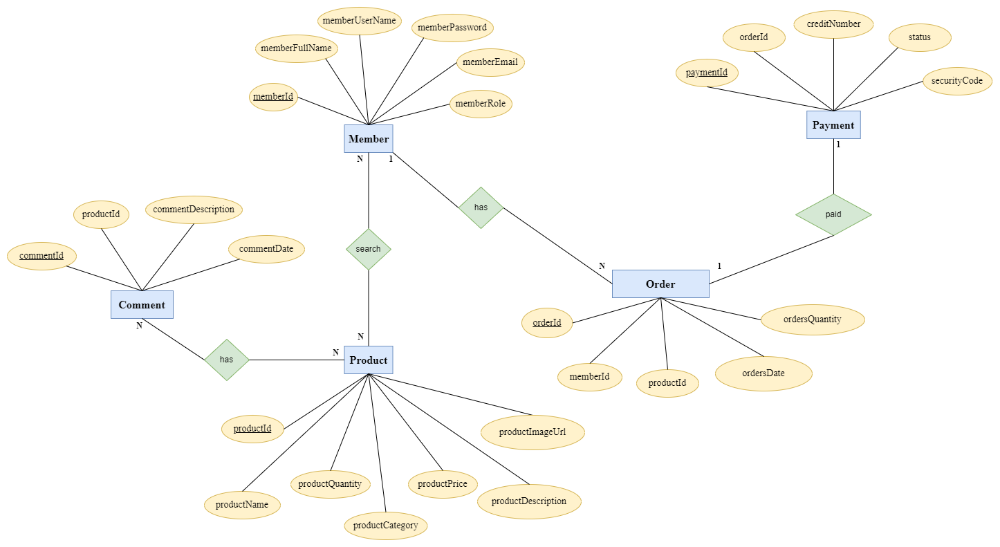
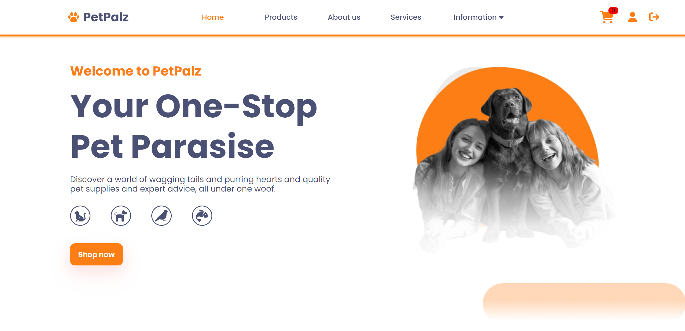
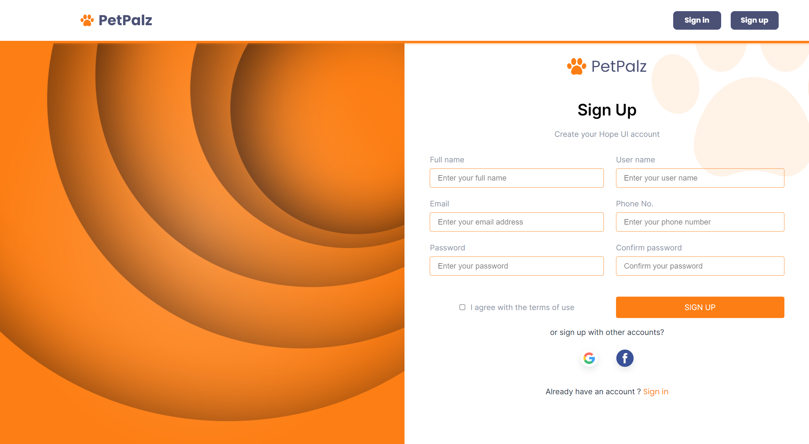
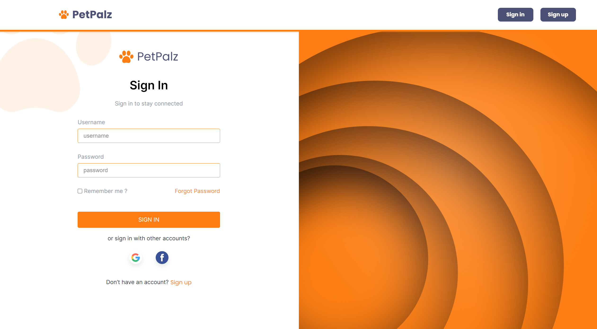

<!-- Project Logo -->
<div id="top" align="center">
    
    <h1 align="center">PetPalz</h1>
    <h3 align="center">
        Pet Healthcare Services
        <br />
        for Software Engineering course at International University - VNU
        <br />
        <br />
        <a href="https://github.com/HCMIU-Software-Engineering/Software-Engineering-Project/issues">Report Bug</a>
        ·
        <a href="https://github.com/HCMIU-Software-Engineering/Software-Engineering-Project/issues">Request Feature</a>
    </h3>
 </div>

<!-- About -->

# ABOUT

## 1. The team behind it

| No. |       Full Name       | Student's ID |              Email               |                      Github account                      |                      Roles                       | Contribution |
|:---:|:---------------------:|:------------:|:--------------------------------:|:--------------------------------------------------------:|:------------------------------------------------:|:------------:|
|  1  |  Nguyen Trong Nghia  | ITITIU20257  | ITITIU20257@student.hcmiu.edu.vn |        [nguyentrongnghia1702](https://github.com/nguyentrongnghia1702)         | **TEAM LEADER** Project Manager |     10%      |
|  2  |   Duong Khanh Duy   | ITITIU20194   | ITITIU20194@student.hcmiu.edu.vn |       [kingstonduy](https://github.com/kingstonduy)        |        Back-end Developer         |     10%      |
|  3  | Nguyen Luan Cong Bang | ITITIU20163  | ITITIU20163@student.hcmiu.edu.vn |     [congbangitiu](https://github.com/congbangitiu)      |               Front-end Developer                |     10%      |
|  4  |     Pham Minh Vu      | ITITIU20354  | ITITIU20354@student.hcmiu.edu.vn |          [PMinhVu](https://github.com/PMinhVu)           |               Back-end Developer                |     10%      |
|  5  |   Phan Nguyen Hoang Bao    | ITITIU20165  | ITITIU20165@student.hcmiu.edu.vn | [PhanNguyenHoangBao-ITITIU20165](https://gist.github.com/PhanNguyenHoangBao-ITITIU20165) |               Front-end Developer                |     10%      |
|  6  |   Pham Gia Bao    | ITITIU20166  | ITITIU20166@student.hcmiu.edu.vn | [giabao18](https://gist.github.com/giabao18) |               Front-end Developer                |     10%      |
|  7  |   Le Cao Nhat Hoang    | ITITIU20205  | ITITIU20205@student.hcmiu.edu.vn | [HoangLeCoder](https://gist.github.com/HoangLeCoder) |               UI/UX Designer                |     10%      |
|  8  |   Huynh Thi Tu Chi    | ITITIU20175  | ITITIU20175@student.hcmiu.edu.vn | [tuchihuynhxjulie](https://gist.github.com/tuchihuynhxjulie) |               Business Analyst                |     10%      |
|  9  |   Truong Duc Duy Khang    | ITITIU20227  | ITITIU20227@student.hcmiu.edu.vn | [ITITIU20227](https://gist.github.com/ITITIU20227) |               UI/UX designer                |     10%      |
|  10  |     Nguyen Thi Thanh Thao      | ITITIU20310  | ITITIU20310@student.hcmiu.edu.vn |          [nanalynh](https://github.com/nanalynh)           |               Business Analyst                |     10%      |
---------------
## 2. The project we are working on

An online marketplace called the **PetPalz** serves the various demands of pet owners and enthusiasts. It provides a wide selection of goods and services, such as pet food, grooming products, and necessary medical supplies. The platform offers a marketplace for pet services like grooming, training, veterinary care, and pet sitting along with an easy-to-use interface and sophisticated search capabilities. 

Additionally, by offering instructional materials on behavior, health, and pet care, it promotes a feeling of community. The website offers customized product recommendations based on user profiles and preferences by utilizing sophisticated algorithms. For convenience, the platform is mobile-friendly and offers secure transactions. Users can get help from the committed customer care team with any questions or issues. 

---------------

## 3. Goal

Our project aims achieve these goals:

- []() Design a website that can be put into use and sell products.

- []() Connect front-end interface to back-end database using Java connection driver.

- []() Develop login/logout, account creation, booking functions, add, remove to cart.

---------------

<!-- REASON -->

# REASON

## 1. Motivation

There aren't many stores that offer food, beverages, and pet-related products right now. Young people who love animals thus have a hard time finding a location to buy food, and they have to drive dozens of kilometers to locate a veterinarian facility if one of their pets becomes ill. Due to these shortcomings, we developed a website where we offer food and beverages as well as medical evaluation and treatment services.

## 2. Idea

In order to address these issues and fulfill the growing need for medical evaluation and treatment, necessities, and pet care services. For these reasons, we developed PetPalz. You may schedule a medical examination or treatment service, order food or beverages to be brought to your house, and do all of this while you're comfortably seated at home.


## 3. Roadmap

- [x] The system allows customers to search for items and add it to the cart
- [x] Customers can make an appointment in advance to use the service
- [x] Customers also search for disease or tips for growthing thier pets
- [ ] More to come...

---------------

<!-- METHODOLOGY -->

# METHODOLOGY

## 1. Feature Analysis

- **Login**: This page requires users to fill in login information including username and password. After successfully logging in, the user can explore the page. In case of unsuccessful login,  users need to review some common reasons such as: wrong username, wrong password, or not registered account. And note that only registered accounts can log in to the system.
- **Register**: This page requires users to fill in login information including username and password. After successfully logging in, the user can explore the page. In case of unsuccessful login, users need to review some common reasons such as: wrong username, wrong password, or not registered account. And note that only registered accounts can log in to the system.
- **Filter products**: In this space, customers can conveniently search for desired items. Filters allow combining several search categories such as food, fashion, toys, grooming. And the result received will be the customer's desired product with necessary information such as images, detailed information, price, status (in stock/ out of stock).
- **Add to cart**: Below each product, customers see an “Add to Cart” button. After selecting their favorite item, customers can click this button to add it to their cart. 
- **Buy products**: This role describes the procedure of exchanging payments for the purchase of products or services. Selecting products, adding them to an online shopping basket, and completing a transaction are the steps involved in purchasing products when it comes to online shopping or e-commerce. 
- **Booking service**: The process of reserving or scheduling a particular service or activity in advance is referred to as "booking services". Securing a time slot, appointment, or reservation for a specific service is normally the goal of the booking procedure. The following are the essential steps in making a service reservation: Selecting the Service, Checking Availability, Providing Details, Selecting Date and Time, Confirming Details, Providing Contact Information, Payment (if applicable), Receiving Confirmation.
- **Check-out products**: This function describes the procedure for finishing an online shopping cart purchase for specific products. Customers who wish to proceed with a purchase after adding items to their virtual shopping cart on an e-commerce website or app must go through a sequence of stages known as the checkout process, which includes: View Shopping Cart, Proceed to Checkout, Provide Shipping Information, Choose Shipping Method, Select Payment Method, Enter Payment Information, Review Order Summary, Place Order, Receive Order Confirmation. 
- **Change password**: The act of changing the current password linked to a user account is referred to here. To improve security, this action is frequently taken.Ensuring that each account has a strong password that is distinct from the others is a recommended security measure. It increases general internet security and aids in preventing unwanted access to accounts.
-**Search items in purchase history**: Users can look for and examine their prior purchases with this function. Customers can use this tool to find specific things they have previously purchased, keep track of their past purchases, or confirm the specifics of a particular transaction.
-**Log out**: The act of terminating a session or connection with a website, application, or computer system is known as "logging out," which also ends access to the system or service. In order to prevent unwanted access, this is essential for security, particularly on shared or public computers.


## 2. Diagram

Please take a look at the diagrams to familiar yourself with our project

### a. ERD

<div align ="center">

</div>

### b. Class Diagram

<div align ="center">

</div>

### c. Use Case Diagram

<div align ="center">

</div>

## 3. How to run
Config the database port, username, password at 
[application.properties](/API/petcare/src/main/resources/application.properties)

We havent figue out the way to auto generate schema and tables in springboot for mysql. So please create schema "petcare" then paste the prepared queries at 
[data.sql](/API/petcare/src/main/resources/data.sql) into query of mysql 

run the java main at 
[PetcareApplication.java](/API/petcare/src/main/java/com/petcare/rest/webservices/restful/PetcareApplication.java)

then in vscode

```
    cd petcareapp
    npm install
    npm install react-scripts --save
    npm install @mui/icons-material @mui/material @emotion/styled @emotion/react
    npm start

```


-----------------

## 4. Tech
- [Spring Boot](https://spring.io/projects/spring-boot/): framework back-end helps building web application and restful API.
- [ReactJS](https://reactjs.org): A JavaScript library helps to develope user interface.
- [Draw.io](https://drive.google.com/file/d/1h6-D9My7gsEzm0dVq5bSvzzJ9OZOFOKs/view?usp=sharing): Software that helps to analazye and design database
- [Figma](https://www.figma.com/file/Df5p9OXAeNaJZ2zIOWXiEb/mew-Pet-care-landing-page-(Community)?type=design&node-id=0%3A1&t=jZTtFVkTb2W9ajBI-1): A tool design UX/UI - develop prototype interface.
- [Talend API Tester](https://chrome.google.com/webstore/detail/talend-api-tester-free-ed/aejoelaoggembcahagimdiliamlcdmfm): API manipulation tool - helps test various APIs.
- [My SQL](https://www.mysql.com/): "Database management system - facilitates website data management."

-----------------

## 5. Web Architucture

- #### Web Architucture


-----------------


## 6. Demo

- #### HomePage
<div align ="center">

</div>

<br/>

- #### Register Page
<div align ="center">

</div>

<br/>

- #### Login Page
<div align ="center">

</div>

- ### User Account Page
<div align ="center">

</div>

- ### Service Page
<div align ="center">

</div>

- ### Product Page
<div align ="center">

</div>

- ### Information Page
<div align ="center">

</div>

- ### Order Page
<div align ="center">

</div>